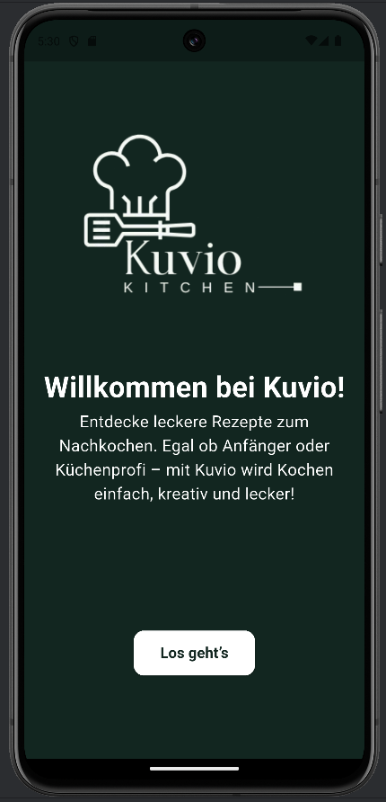
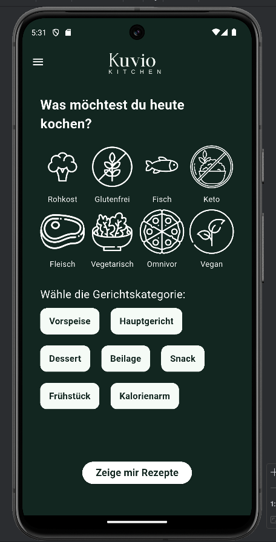
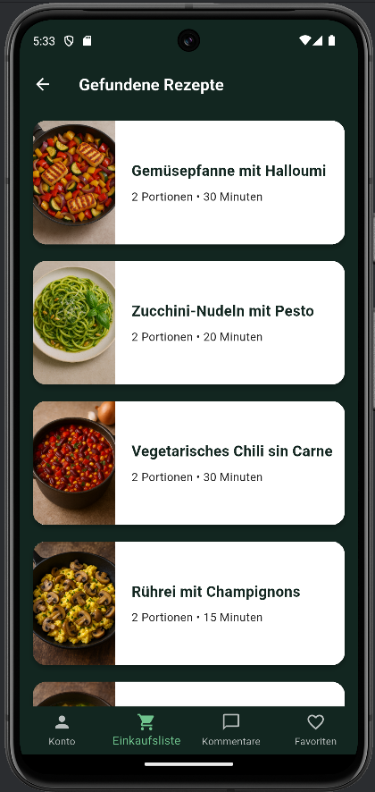
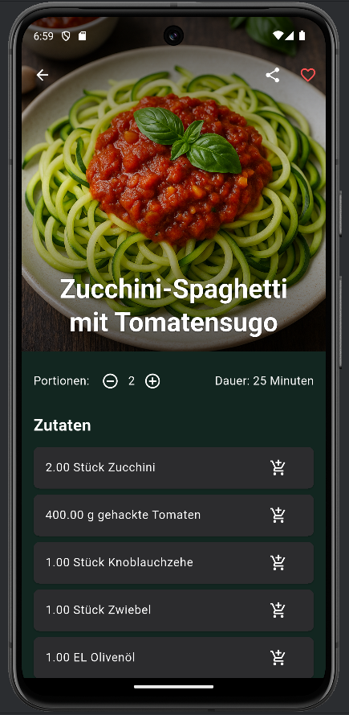
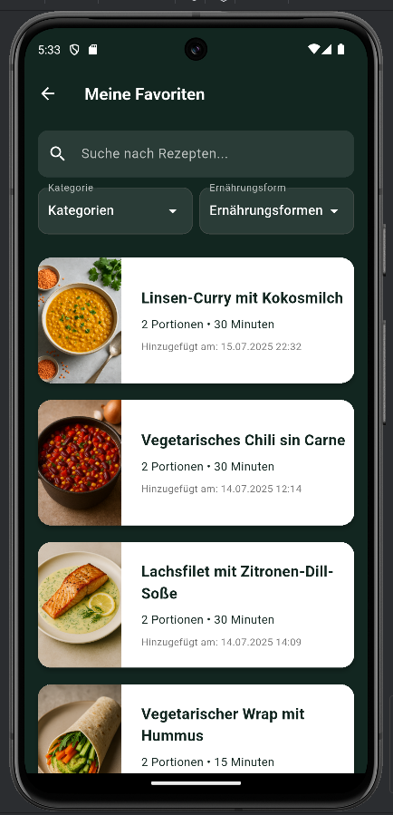
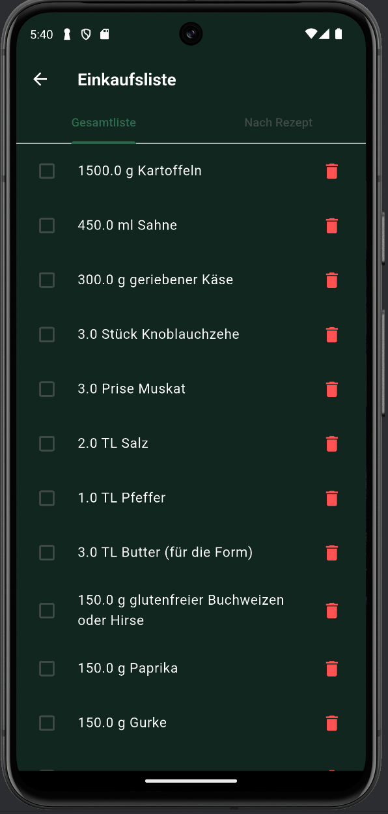
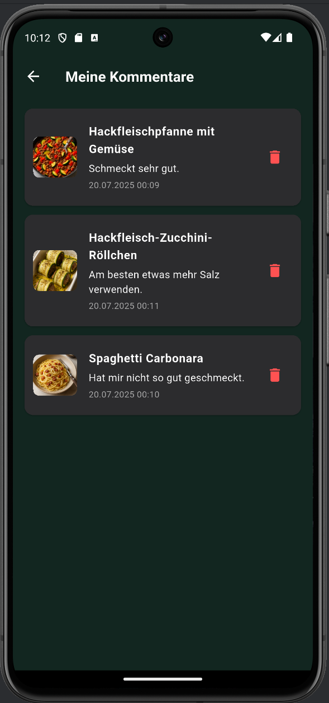
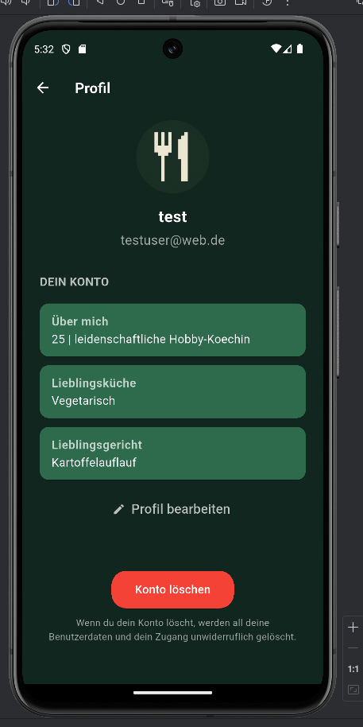
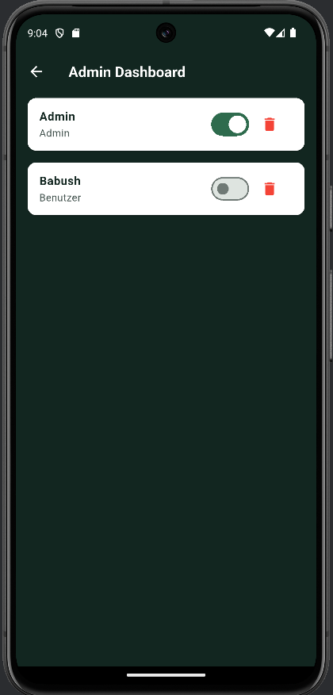

# Kuvio Kitchen 

A cross-platform mobile recipe app built with **Flutter** and **Firebase**, developed as part of the "Development of Mobile Applications" course at Hochschule Worms in summer semester 2025.

---

## Badges


---

## Features

- **Recipe browsing** – Filter recipes by diet type (e.g. vegetarian, vegan, keto) and category (e.g. main course, dessert, breakfast)
- **Recipe detail view** – Full ingredients list with adjustable serving sizes, preparation time, and nutritional info
- **Favorites** – Save and manage your favourite recipes with search & filter
- **Shopping list** – Add ingredients directly from recipes; view by total list or grouped by recipe
- **Comments** – Write, view, and delete comments on recipes
- **User profiles** – Editable profile with avatar selection, bio, favourite cuisine & dish
- **Authentication** – Email/password login and Google Sign-In via Firebase Auth
- **Dark mode** – Toggle between light and dark theme
- **Multilingual** – Full German and English support
- **Offline mode** – Access previously loaded recipes and shopping list without internet
- **Admin dashboard** – Manage user roles and delete accounts (admin only)

---

## Tech Stack

| Layer | Technology |
|---|---|
| Framework | Flutter 3.32.2 |
| Language | Dart 3.8.1 |
| Auth | Firebase Authentication |
| Database | Cloud Firestore |
| Monitoring | Firebase Crashlytics & Analytics |
| IDE | Visual Studio Code |
| Emulator | Android Studio |

---

## App Preview

### Welcome Screen


### Recipe Filter


### Recipe List


### Recipe Detail View


### Favorites


### Shopping List


### Comments


### Profile


### Admin Dashboard


> All screenshots are located in the `screenshots/` folder and can be updated at any time.

---

## Installation

### Requirements
- [Flutter SDK](https://docs.flutter.dev/get-started/install) (3.32.2 or later)
- Android device or emulator (Android Studio)
- Git

### Steps

1. **Clone the repository**
```bash
git clone https://github.com/DeineBabushka/kuvio-android-app.git
cd kuvio-android-app
```

2. **Install dependencies**
```bash
flutter pub get
```

3. **Firebase setup**  
   The `google-services.json` for Android is already included in the repo. No separate Firebase Console setup required.

4. **Run the app**
```bash
flutter run
```

---

## Test Accounts

| Role | Email | Password |
|---|---|---|
| User | testuser@kuvio.de | test123! |
| Admin | admin@kuvio.de | admin123! |

---

## Architecture

The app follows a **feature-based architecture** — each feature (e.g. `auth`, `comments`, `account`) has its own folder containing `screens`, `services`, `utils`, and `widgets`. This ensures a clear separation of concerns and makes the codebase easy to extend.

**Firestore collections:**
- `recipes` – recipe data (title, ingredients, category, diet type, …)
- `comments` – user comments linked to recipes
- `favorites` – saved recipes per user
- `shopping_list` – ingredients added from recipes
- `users` – user profiles (username, avatar, bio, admin flag)

---

## Authors

Developed by:
- me & 
- Symeon Karagkiaouris
- Valentin Pruin

**Course:** Entwicklung Mobiler Anwendungen – Hochschule Worms, SS 2025  
**Supervisor:** Laura Most

---

## License

[](https://creativecommons.org/licenses/by-nc-nd/4.0/)

This project was developed for academic purposes at Hochschule Worms (SS 2025).  
Viewing the source code is permitted. Copying, modifying, or distributing is **not allowed**.
